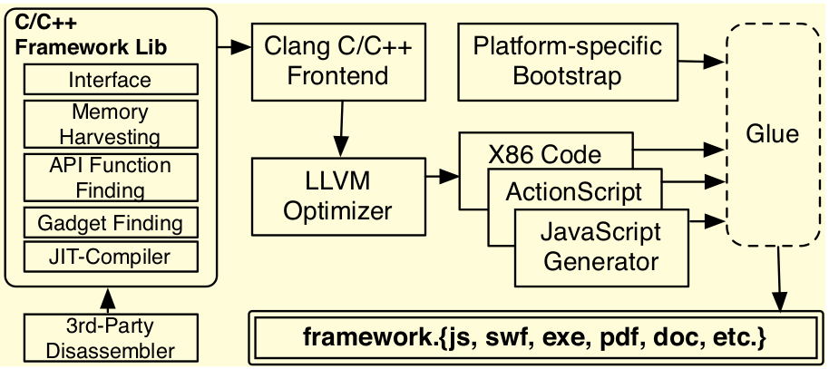

### Attack Summary

***JIT-ROP*** is a code-reuse attack that abuses a memory disclosure to ***map an application's memory layout*** on the fly, dynamically discovering functions and gadgets and JIT-compiling a target program using those gadgets. A framework is presented that given a target program and memory disclosure, the runtime framework will build a *ROP chain* that corresponds to the given program. The attacker will get the exploit in a buffer and trick the execution flow. Under the hood, the framework maps memory pages using control flow analysis, discovers va of API functions, validates the discovered gadgets, chains them before serializing the payload and giving control back to the attacker.

### Attacker Threat Model

The stack and heap are ***NX (or DEP)***. JIT-spraying mitigations are in place: ***W+X, constant elimination, random nop insertions***. ***ASLR*** and ***fine-grained  ASLR*** are in place which deploys base address randomization, all useful, predictable mappings have been eliminated, order of functions and basic blocks is permuted, registers are swapped and instructions replaced, the location of each instruction is randomized and a randomization is performed upon each run of an application.

### Recipe

The first step of the attack is to map the code page memory. The knowledge of a single valid code pointer reveals that an entire 4 kilobyte-aligned page of memory is guaranteed to be mapped. The exploit writer has to provide a ***single memory disclosure***. ***Static-code analysis*** techniques are then used to identify both direct and indirect `call` and `jmp` instructions. 

The next step is to discover the ***virtual addresses of API functions*** used in the attacker-supplied program. This can be done by creating ***signatures based on opcode sequences or call sites*** of the API functions, then match those signatures to call sites in the traversed page at run-time. 

Now that a significant portion of the vulnerable application's code layout is mapped and API function pointers have been collected, the attacker needs to accumulate a set of concrete gadgets to use as blocks for the JITed code-reuse payload. This is done by using a modified version of the `Galileo` algorithm to iterate over the harvested code. A single table-lookup is performed  to check if the first instruction type in the sequence meets one of the gadget semantic definitions, and if it does it is added to the unique set (checking the output register and eventual side effects).

Next, the attacker needs to generate the payload to execute. A dynamic compilation is required to ensure several gadget types are available to build the final payload. To do so, it parses the program written in a simple grammar, that is extended to an AST for each program statement where each node is a gadget type.

The payload is serialized to a structure accessible from the script and control is returned to the exploit writer's code.

### Tools and Setup

JIT-ROP is constructed as a C/C++ project (~3000 lines of code).



IE8 on Windows 7  is exploited using CVE-2012-1876. Heap Fencg Shui is applied to arrange objects on the heap. Next an overflow is used to write a value

```javascript
// The string object is overwritten, and initial code
// pointer harvested prior to this snippet of code
// Step 1, implement DiscloseByte interface
framework.prototype.DiscloseByte = function(address) {
var value = this.string_.charCodeAt(
(address - this.absoluteAddress_ - 8)/2);
if (address & 1) return value >> 8;
// get upper
return value & 0xFF; // value is 2 bytes, get lower
};
// Define target program (’@’ is shorthand
// for ’last value returned’)
var program =
    ”LoadLibraryW(L’kernel32’);” +
    ”GetProcAddress(@, ’WinExec’);” +
    ”@(’calc’, 1);” +
    ”LoadLibraryW(L’kernel32’);” +
    ”GetProcAddress(@, ’ExitProcess’);” +
    ”@(1);”;

// Steps 2-4, harvest pages, gadgets, functions
framework.HarvestCodePages(this.initialCodePtr_);

// Step 5, 6 - jit-compile and build exploit buffer
var exploitBuffer =
    repeat(0x3E, unescape("%u9191%u9191")) + // Id
    repeat(0x19, framework.NoOpG())        + // Sled
    unescape(framework.Compile(program))   + // Payload
    repeat(0x12, unescape("%u4545%u4545")) + // Pad
    repeat(0x32, framework.StackPivotG());   // Redirect
// overwrite with the exploit buffer
// ... snip ...
```

