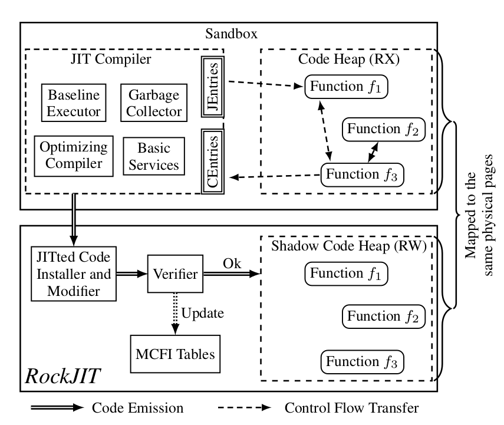

### Defense Summary

***RockJIT*** builds a fine-grained control-flow graph from the C++ source code of the JIT compiler and dynamically updates the control-flow policy when new code is generated on the fly.

### Attacker Threat Model

An attacker is modeled as a concurrent user-level thread, running in parallel with other threads in the JIT compiler. The attacker thread an read and write any memory, subject to memory page protection. It is assumed the context switches between the JIT compiler and JITed code are conducted through a set of interfaces. The JITed code is assumed to not contain direct system call invocations and privileged instructions (it is however possible for the JITed call to request OS system calls from the JIT compiler itself).

### Background

***Modular Control-Flow Integrity***, a program is divided in modules and each module contains not only code and data but also auxiliary information used to generate a new CFG when linking with other modules. MCFI represents the CFG in tables during runtime. Thread-safe table transactions are used to access and update the tables.

### Recipe

