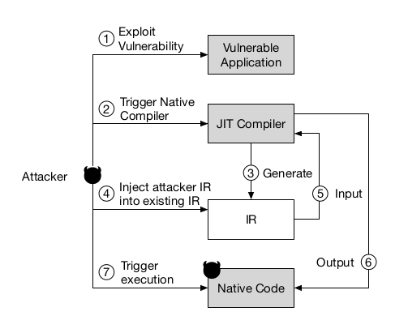
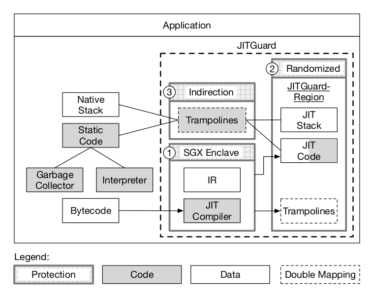

### Attack Summary

***Data-Only JIT Attack (DOJITA)*** that manipulates the IR to trick the JIT compiler into generating arbitrary malicious payloads. 

### Attacker Threat Model

Static code is protected, code-injection is prevented by enforcing DEP, code-reuse attacks are defeated by randomization-based solutions or control-flow integrity. It is assumed the static code of the application and OS are not malicious. Moreover, data is randomized using ASLR. The attacker has access to a memory corruption vulnerability. They can exploit it to disclose and manipulate data memory of known addresses. The attacker has access to the scripting engine and can perform arbitrary (sandboxed) computations at run time.

### Recipe

The attacker exploits a memory corruption vulnerability to read and write arbitrary data memory then identifies a hot function that will be translated to machine code. During the compilation of the function, the JIT compiler will generate the corresponding IR. The attacker locates the IR, injects C++ crafted objects and lets the ***JIT compiler*** execute the shellcode for them.

---

### Defense Summary

***JITGuard*** uses the ***Intel's Software Guard Extensions (SGX)*** to build a trusted defense. **(1)** SGX is used to isolate the JIT compiler and its data from the rest of th application. The attacker can no longer exploit memory-corruption vulnerabilities in the host process to launch attacks against the JIT compiler. **(2)** The JIT code and stack memory addresses are randomized to protect against code-injection and code-reuse attacks. **(3)** Segmentation registers are used to build an indirection layer that prevent information-disclosure attacks that target the transition between static and JIT code. **(4,5,6)** Double-mapping is used to restrict the vulnerable code to be only writable in one mapping while only executable in the other. Mapping **(6)** is used by the compiler to update the trampolines while the potentially vulnerable code only uses **(5)** and cannot overwrite the trampolines.

