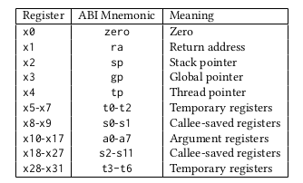

<!-- Please prefix the notes with the date as in [22/12/2020] -->

[18/05/2021]

Preventing the introduction of malicious code is not enough to prevent the execution of malicious computations. ***Return-oriented  programming*** thinks of reusing the code already present from intended operations to perform an attack. Several mitigations have been developed such as `gcc`'s `-mmitigate-rop`, G-Free or even Control-Flow Integrity. 

Return-object Programming consists of injecting a succession of call frames in the stack. Each call frame on the stack will result in the execution of a ***gadget***, a small snippet of legitimate code containing a a small number of instructions ended by a `ret`. When the `ret` instruction is reached, the address of the next gadget is popped from the stack into the program counter. Arbitrary code may be executed providing that enough gadgets are available. Two categories of gadgets can be distinguished: ***Main Execution Path (MEP)*** from legitimate code written by the programmer and ***Hidden Execution Path (HEP)*** that uses overlapping code such as sections that have another interpretation depending on its internal status (32- or 64-bits, Thumb mode, offset of the execution, etc.). ***HEP*** has the advantage that it bypasses traditional compiler stack protections.

The ***Galileo*** algorithm allows the detection of gadgets in any executable memory region. It is based ona backward disassembly method, starting from every return instruction and then trying to bruteforce the length of the previous instruction. The payload is then designed based on the discovered gadgets and the injection method.

The base RISC-V ISA can be extended with several extensions: **M** for integer multiplication and division, **A** for atomic operations, **F, D and Q** for single-, double- and quad-precision floating-point operations, **L** for decimal floating-point operations, **C** for compressed instructions, **J** for just-in-time instructions, **T** for transactional memory, **P** for packed-SIMD instructions, **V** for vector operations and **N** for user-level interrupts. The general extension (**G**) includes **IMAFD** and the one agreed on by Debian and Fedora for Unix platforms is the RV64GC ISA. The RISC-V architecture consists of 32 floating-point registers (`f0-f31`), a program counter (`pc`), 31 general purpose 64-bit registers (`x1-x31`) whose usage is shown in the table below as well as various control and status registers. 

RV64GC features 32- and 16-bit instructions, aligned on 16 bits. Instruction length is encoded in the LSB (lowest-address as RISC-V is little endian). 16-bit instructions require the last two bits to be different from 11 whereas 32-bit instructions have their last two bits equal to 11 and the three previous different from 11. This means that there is a possibility for overlapping instructions that can be obtained by either using two 32-bit instructions 2 bytes apart or by using a 32-bit instruction whose last 2 bytes are also a valid 16-bit compressed instruction.

**Threat model:** The system consists of RISC-V systems with ROP mitigations deployed such as DEP, ASLR as well as `gcc`'s `-fstack-protector-strong` (since `gcc`'s `-mmitigate-rop` or `clang`'s CFI are not available on RISC-V).

**Backdoor:** Adding a backdoor that consists of a ***trigger*** and a ***payload*** to access a privileged state.  leading to a ROP attack. This often consists of exploiting an SUID program to perform *privilege escalation*. The attacker can then create a concealed persistent backdoor on a compromised system to ensure they have access to the exploit at any time in the future.

**Gadget Chaining:** Hidden gadgets are inserted in the code using one function per gadget, each ending with a C `return` function. Note that for each function, the compiler may add assembly code at the beginning and the end whose purpose is to *insert (save)* or *remove (restore)* the call frame from the stack. Those *restore* are essential in ROP attacks as they tamper with the return address register. The hidden instructions are written directly in C code, and feature one or two instructions followed by a jump to a relative offset. 

